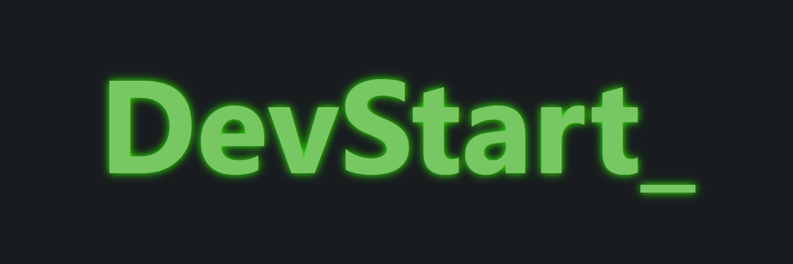

Aqui foi um exercício passado em sala no *SENAC Cidade Alta* para treinar e avaliar o nível de CSS. Eu gostei bastante do resultado final e decidi publicar aqui. 
O resultado foi este site que pretendo incrementar mais lá na frente.

## FEATURES
Algumas das features mais notáveis que aprendi neste exercício:

- Keyframes 🖼️
- Função Glow ✨
- Redirecionamento de botão para seções dentro do página ↕️
- Aplicação do Grid com vários cards 📩

## Assuntos Aplicados
- HTML
- CSS

Espero que gostem!  
<b>Feito com ❤️</b>
